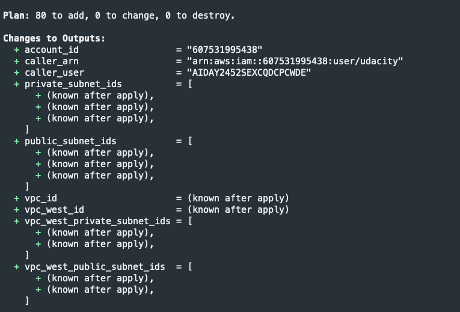
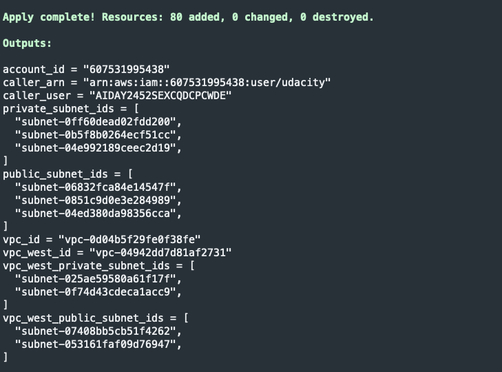
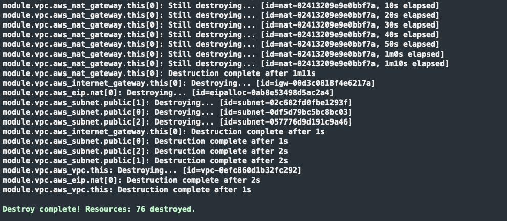
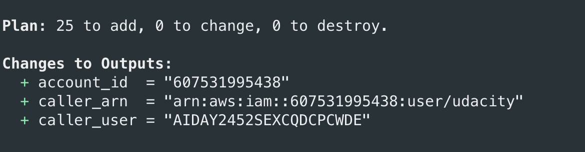
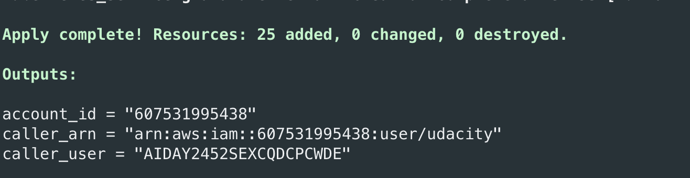
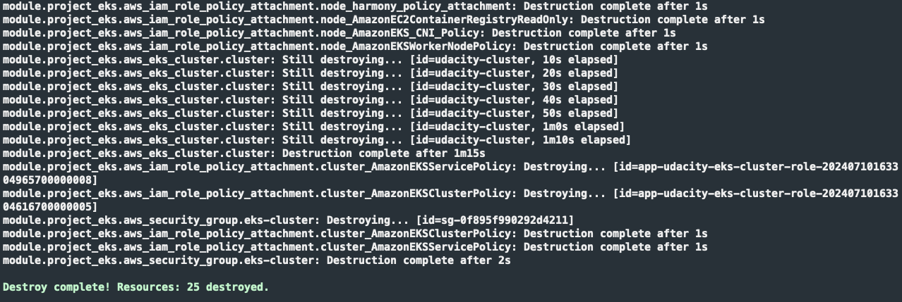
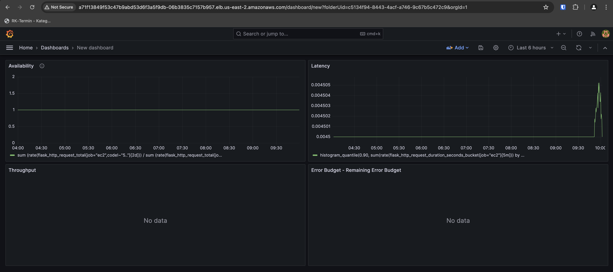
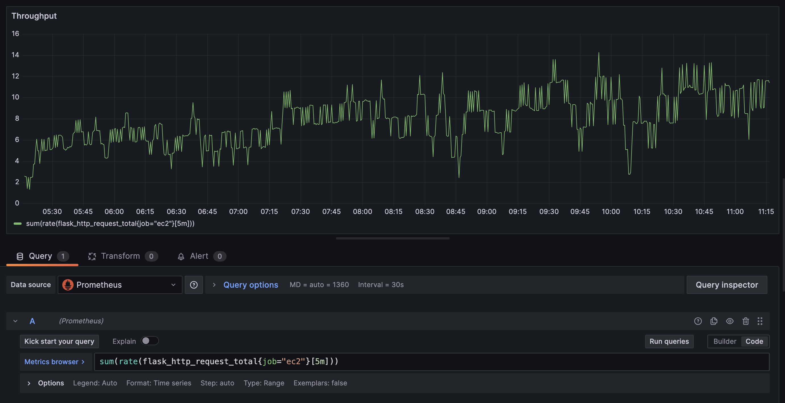

## Terraform screenshots

## Zone 1

Terraform Plan

Terraform Apply

Terraform Destroy

## Zone 2

Terraform Plan

Terraform Apply

Terraform Destroy

## Grafana screenshots

## EC2 Dashboard

The following screenshot shows the Grafana dashboard built

The following screenshot shows that there are metrics for *flask_http_request_total*. The reason why there are no graphics for two of the views shown above, is because the calculations that we require based on *flask_http_request_total* don't have enough data available. This is mentioned in the project requirements and expectations from Udacity. I'm attaching this as proof that the data scrapping was successful. 

